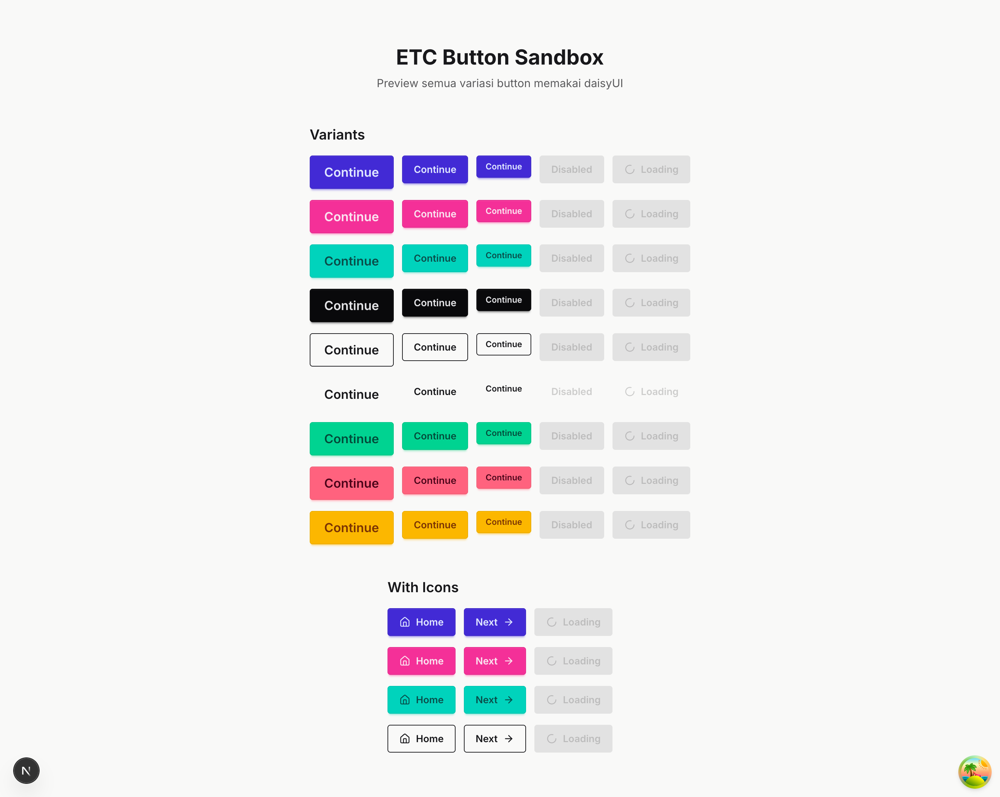
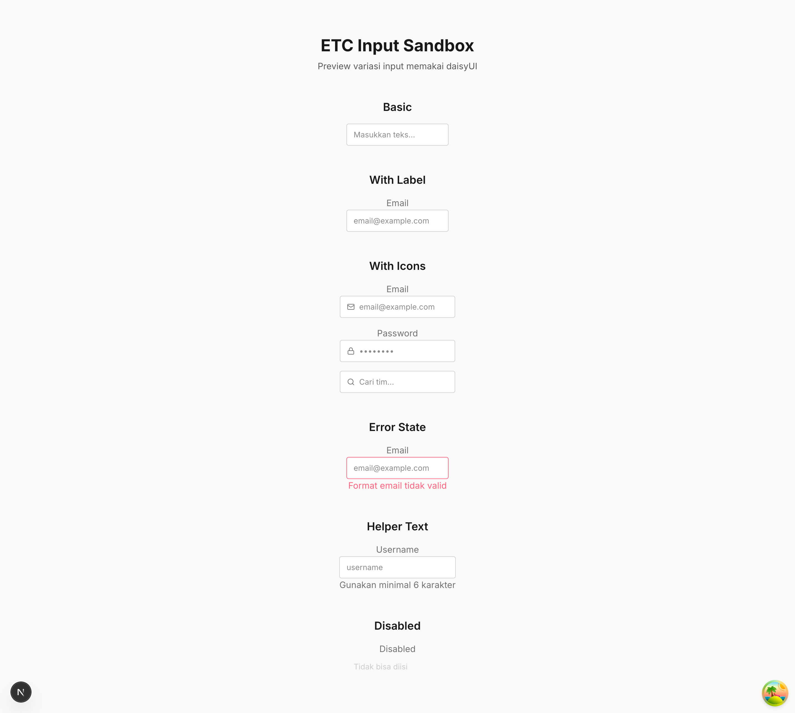
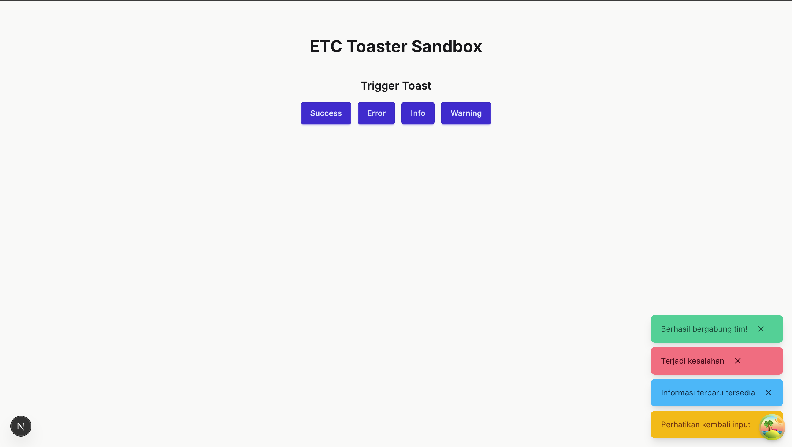

## Quick Start

### Clone the Repository

````bash
git clone https://github.com/farrasnazhif/etc-fe.git
cd etc-fe

1. Install dependencies:

```bash
pnpm install
````

2. Start development server:

```bash
pnpm dev
```

3. Open `http://localhost:3000`.

## Sandbox

1. Button Sandbox

- path: /sandbox/button

  

2. Input Sandbox

- path: /sandbox/input

  

3. Toaster Sandbox

- path: /sandbox/toaster

  
